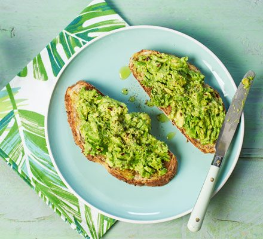

# How to Make Avocado on toast

## Needed Items

- Bread
- Toaster
- Knife
- Fork
- Lemon
- 1 Avocado
- Pinch of Salt

## Steps

1. Toast a slice of bread until golden brown.
2. Remove pit from avocado.

    a.  Cut avocado lengthwise until you feel the knife hit the pit.

    b.  Spin avocado while continuing to cut around the pit.

    c.  Twist the two halves to separate them.

    d.  Carefully hit the pit with your knife and remove it.

3. Scoop out the flesh of the avocado with a spoon and place it in a bowl.
4. Mash the avocado with a fork until smooth.
5. Squeeze half a lemon and a pinch of salt into the bowl
6. Mix avocado mixture.
7. Spread on top of toast and serve (Figure 9).

>   
> Figure 9 -- Final product for avocado on toast
