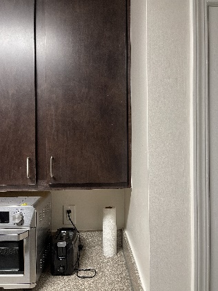
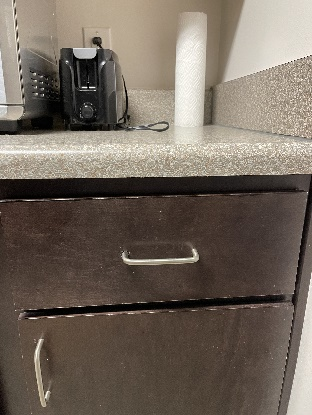
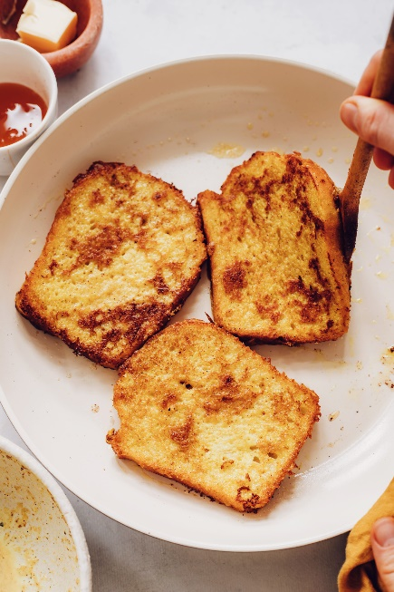
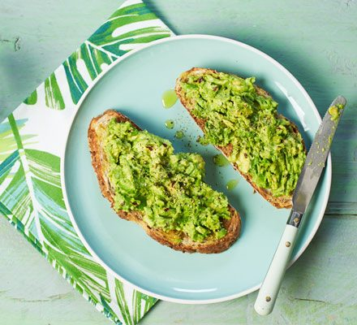

# Welcome

Hello Armando and Mom! I hope you both are having a good morning. I am
sorry that I am unable to be with you guys to give a tour of the new
apartment, but I have written a guide to help you so that you can
navigate the kitchen to make breakfast. This guide provides multiple
recipes for you to pick from that use the kitchen equipment and food
that is currently available in the apartment. The recipes were made with
both of you in mind. Armando, being that you are vegan, I have included
two recipes for dishes that you can enjoy which are the vegan French
toast and the avocado on toast. These are easy to make and follow so
that you can make breakfast while also getting accustomed to the new
apartment. Mom, I have included some recipes that are here for you that
are not vegan, which is the omelet and the pancakes. I know that you are
all too familiar with these dishes so you will not need them, but this
guide should help you find all the things needed for the recipe. Have a
wonderful time cooking breakfast at the apartment using this guide to
help!

# How to Navigate the kitchen

The first thing that you will need to know to make breakfast is where
everything is in the kitchen. To help you navigate, I will tell you
where all the kitchen essentials are located. In the apartment, the
equipment and food are in one of five separate places: refrigerator,
pantry, top cabinet, lower cabinet, or drawer. Each place contains
different kitchen tools or food items and are organized in such a way to
make it easy for you to find.

## Refrigerator

The refrigerator is located on the left side of the kitchen (Figure 1)
and stores all essential groceries that need to be refrigerated like
eggs, milk, etc.

> {width="1.8854166666666667in"
> height="2.513888888888889in"}
>
> Figure 1 -- Picture of refrigerator

Remember to put back any ingredients from the refrigerator back after
you are done using them, so they do not spoil.

## Pantry

The pantry is located on the right side of the kitchen (Figure 2) and
contains other food items that do not need to be refrigerated like
flour, snacks, etc.

> {width="1.5390627734033246in"
> height="2.0520833333333335in"}
>
> Figure 2 -- Picture of pantry

Be careful when grabbing items from the pantry so that you do not knock
any items down.

## Top Cabinet

This is the furthest right cabinet located above the counter and to the
left of the pantry (Figure 3). This cabinet contains dishes, cups, as
well as oil and spices that are often used when cooking.

> {width="1.4375in"
> height="1.9166666666666667in"}
>
> Figure 3 -- Picture of top cabinet

## Bottom Cabinet

This cabinet is in line with the top cabinet, but it is below the
counter (Figure 4) and contains larger kitchen utensils like mixing
bowls, pots, pans, etc.

> {width="1.484374453193351in"
> height="1.9791666666666667in"}
>
> Figure 4 -- Picture of bottom cabinet

## Drawer

This is located in between the top and bottom cabinet and next to the
pantry (Figure 5). This drawer contains all utensils like forks, spoons,
knives, spatulas, etc.

> {width="1.4166666666666667in"
> height="1.8888888888888888in"}
>
> Figure 5 -- Picture of drawer

# How to Decide What to Make

Now that you both know a little bit more about the layout of the
kitchen, you guys must pick what to make. I have included 4 recipes to
choose from covering a variety of breakfast options. The first two
recipes I chose with Mom in the back of my head as they are things you
made a lot throughout your life and are dishes that you enjoy. The first
recipe that I chose was pancakes. Pancakes are a fantastic way to start
the morning and are not difficult to make with most of the process
involving measuring and mixing ingredients together. The second recipe
that I provided was a veggie omelet. This dish is super healthy with
protein and vegetables to start the day out right. However, these two
recipes are not vegan as they both contain animal products with milk and
eggs.

Keeping this in mind, I have also provided two vegan recipes for Armando
as they fit in with your diet. The first vegan recipe I have provided is
for vegan French toast. Coming from Mozambique, I wanted to give you
something that you may have never tried before. French toast is bread
soaked in a custard mixture which is then pan fried. It is a little more
advanced, and as you are not the most experienced cook, the other recipe
I have provided is much simpler. The next vegan recipe is avocado on
toast. Avocados are delicious and nutritious so adding a few simple
ingredients to it and putting it on toast is a great and efficient way
to start your day.

With these different options, hopefully you guys can cook something that
you will enjoy. If you both want something a little more filling, opt
for the pancakes and French toast. If you want something a little
lighter and healthier, choose the veggie omelet and avocado toast.
Whichever choice you both make, have fun making it in the new apartment
and I wish you both the best of luck.

# How to make Pancakes

## Needed Items:

-   Bowls

-   Whisk

-   Frying pan

-   Oil

-   Measuring cups

-   1 ½ cups of flour

-   1 tablespoon of baking powder

-   ¼ teaspoon of salt

-   1 tablespoon of sugar

-   1 ¼ cups of milk

-   1 egg

-   3 tablespoons of butter

## Steps:

1.  Put butter in a bowl in the microwave and heat until butter melts.

> **Note:** Do not heat butter for too long or it may explode. Remove
> from microwave as soon as it has melted.

2.  Mix flour, baking powder, salt, and sugar together in a mixing bowl.

3.  Make a well in the center of the dry ingredients.

4.  Pour the milk, butter, and egg in the mixture.

5.  Mix ingredients until smooth.

6.  Heat an oiled frying pan over medium heat.

7.  Pour ¼ cups of batter on frying pan for each pancake and cook until
    brown on both sides.

8.  Serve the pancakes and enjoy (Figure 6).

> {width="2.130812554680665in"
> height="2.130812554680665in"}
>
> Figure 6 -- Final pancake product.

# How to make a Veggie Stuffed Omelet

## Needed Items:

-   Pan

-   Oil

-   Rubber spatula

-   Bowl

-   Bell pepper

-   Onion

-   Mushrooms

-   2 eggs

-   Salt

-   Pepper

-   Cheese

## Steps:

1.  Cut desired number of onions, bell peppers, and mushrooms into
    bite-size pieces.

2.  Heat an oil pan on medium-high heat.

3.  Put chopped vegetables in the pan and cook for 2 minutes while
    stirring.

4.  Remove vegetables from pan to a bowl

**Note:** Stove is electric so remember to move pan as the stovetop will
remain hot.

5.  Combine eggs, salt, and pepper in a bowl and whisk until combined.

6.  Reheat pan used for vegetables on medium-high heat.

7.  Pour egg mixture into pan and quickly stir with spatula until it
    begins to thicken.

8.  Cook omelet for a few seconds until the bottom lightly browns.

9.  Add cooked vegetables and cheese to one side of the omelet.

10. Fold the other half of the omelet over the vegetables.

11. Gently slide the omelet out of the pan and serve (Figure 7).

> {width="5.0in" height="2.8125in"}
>
> Figure 7 -- Final product for veggie omelet.

# How to make Vegan French Toast

## Needed Items:

-   Bowl

-   Whisk

-   Oil

-   Pinch of salt

-   ½ cup of almond milk

-   3 tbsp of cornstarch

-   2 tsp of maple syrup

-   ½ tsp of cinnamon

-   1 tsp of vanilla extract

-   Bread

## Steps:

1.  Add cornstarch to a bowl.

2.  Slowly add almond milk to cornstarch while whisking.

3.  Mix in cinnamon, salt, vanilla extract, and maple syrup to bowl.

4.  Heat an oiled pan over medium heat.

5.  Dip bread into mixture for around 15 seconds on each side.

6.  Place the soaked bread into the frying pan.

7.  Cook for about 2 minutes on each side or until both sides are golden
    brown (Figure 8).

8.  Remove French toast from pan and serve.

> {width="1.9791666666666667in"
> height="2.96875in"}
>
> Figure 8 -- Desired cook for French toast

# How to Make Avocado on toast

## Needed Items:

-   Bread

-   Toaster

-   Knife

-   Fork

-   Lemon

-   1 Avocado

-   Pinch of Salt

## Steps:

1.  Toast a slice of bread until golden brown.

2.  Remove pit from avocado.

    a.  Cut avocado lengthwise until you feel the knife hit the pit.

    b.  Spin avocado while continuing to cut around the pit.

    c.  Twist the two halves to separate them.

    d.  Carefully hit the pit with your knife and remove it.

3.  Scoop out the flesh of the avocado with a spoon and place it in a
    bowl.

4.  Mash the avocado with a fork until smooth.

5.  Squeeze half a lemon and a pinch of salt into the bowl

6.  Mix avocado mixture.

7.  Spread on top of toast and serve (Figure 9).

> {width="4.583333333333333in"
> height="4.166666666666667in"}
>
> Figure 9 -- Final product for avocado on toast

# Sources Used

*Easy vegan French toast (10 minutes!)*. Minimalist Baker. (2021, May
3). Retrieved February 3, 2022, from
<https://minimalistbaker.com/easy-vegan-french-toast-10-minutes/>

Kelly, D. (n.d.). *Good old fashioned pancakes*. Allrecipes. Retrieved
February 3, 2022, from
<https://www.allrecipes.com/recipe/21014/good-old-fashioned-pancakes/>
