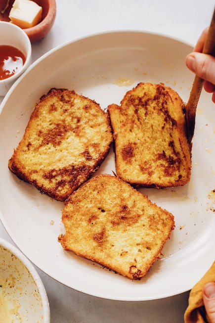

# How to make Vegan French Toast

## Needed Items

- Bowl
- Whisk
- Oil
- Pinch of salt
- ½ cup of almond milk
- 3 tbsp of cornstarch
- 2 tsp of maple syrup
- ½ tsp of cinnamon
- 1 tsp of vanilla extract
- Bread

## Steps

1. Add cornstarch to a bowl.
2. Slowly add almond milk to cornstarch while whisking.
3. Mix in cinnamon, salt, vanilla extract, and maple syrup to bowl.
4. Heat an oiled pan over medium heat.
5. Dip bread into mixture for around 15 seconds on each side.
6. Place the soaked bread into the frying pan.
7. Cook for about 2 minutes on each side or until both sides are golden brown (Figure 8).
8. Remove French toast from pan and serve.

>   
> Figure 8 - Desired cook for French toast
