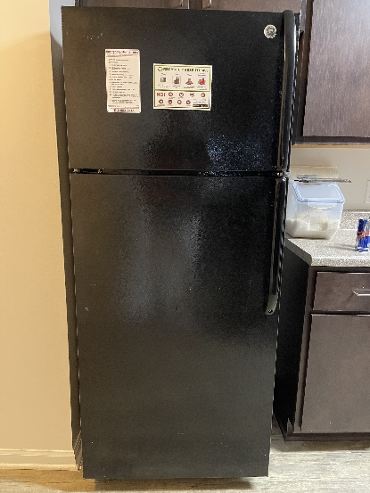
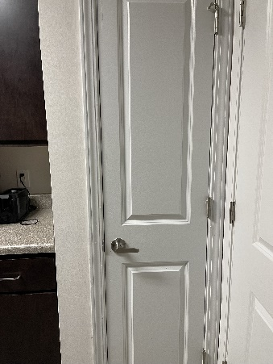
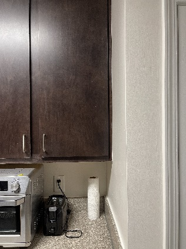
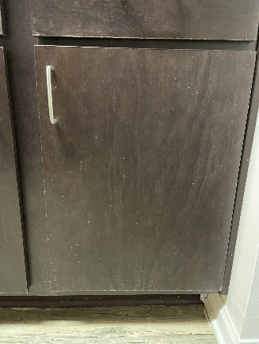
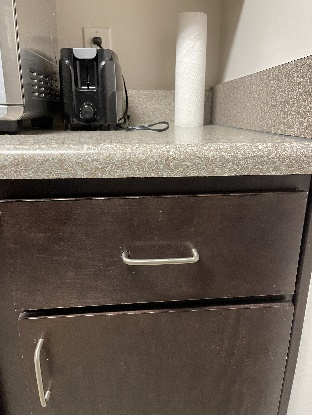

# How to Navigate the Kitchen

The first thing that you will need to know to make breakfast is where
everything is in the kitchen. To help you navigate, I will tell you
where all the kitchen essentials are located. In the apartment, the
equipment and food are in one of five separate places: refrigerator,
pantry, top cabinet, lower cabinet, or drawer. Each place contains
different kitchen tools or food items and are organized in such a way to
make it easy for you to find.

## Refrigerator

The refrigerator is located on the left side of the kitchen (Figure 1)
and stores all essential groceries that need to be refrigerated like
eggs, milk, etc.

  
*Figure 1 - Picture of refrigerator*

Remember to put back any ingredients from the refrigerator back after
you are done using them, so they do not spoil.

## Pantry

The pantry is located on the right side of the kitchen (Figure 2) and
contains other food items that do not need to be refrigerated like
flour, snacks, etc.

  
*Figure 2 - Picture of pantry*

Be careful when grabbing items from the pantry so that you do not knock
any items down.

## Top Cabinet

This is the furthest right cabinet located above the counter and to the
left of the pantry (Figure 3). This cabinet contains dishes, cups, as
well as oil and spices that are often used when cooking.

  
*Figure 3 - Picture of top cabinet*

## Bottom Cabinet

This cabinet is in line with the top cabinet, but it is below the
counter (Figure 4) and contains larger kitchen utensils like mixing
bowls, pots, pans, etc.

  
*Figure 4 - Picture of bottom cabinet*

## Drawer

This is located in between the top and bottom cabinet and next to the
pantry (Figure 5). This drawer contains all utensils like forks, spoons,
knives, spatulas, etc.

  
*Figure 5 - Picture of drawer*


