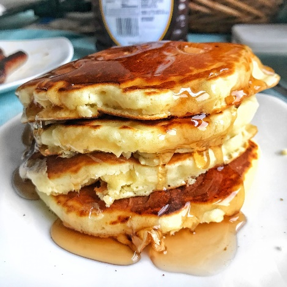

# How to make Pancakes

## Needed Items

- Bowls
- Whisk
- Frying pan
- Oil
- Measuring cups
- 1 ½ cups of flour
- 1 tablespoon of baking powder
- ¼ teaspoon of salt
- 1 tablespoon of sugar
- 1 ¼ cups of milk
- 1 egg
- 3 tablespoons of butter

## Steps

1. Put butter in a bowl in the microwave and heat until butter melts.  
    **Note:** Do not heat butter for too long or it may explode. Remove
    from microwave as soon as it has melted.  
2. Mix flour, baking powder, salt, and sugar together in a mixing bowl.
3. Make a well in the center of the dry ingredients.
4. Pour the milk, butter, and egg in the mixture.
5. Mix ingredients until smooth.
6. Heat an oiled frying pan over medium heat.
7. Pour ¼ cups of batter on frying pan for each pancake and cook until
    brown on both sides.
8. Serve the pancakes and enjoy (Figure 6).

>   
> Figure 6 - Final pancake product.
